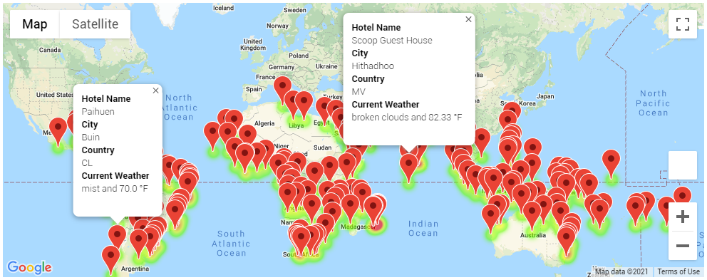
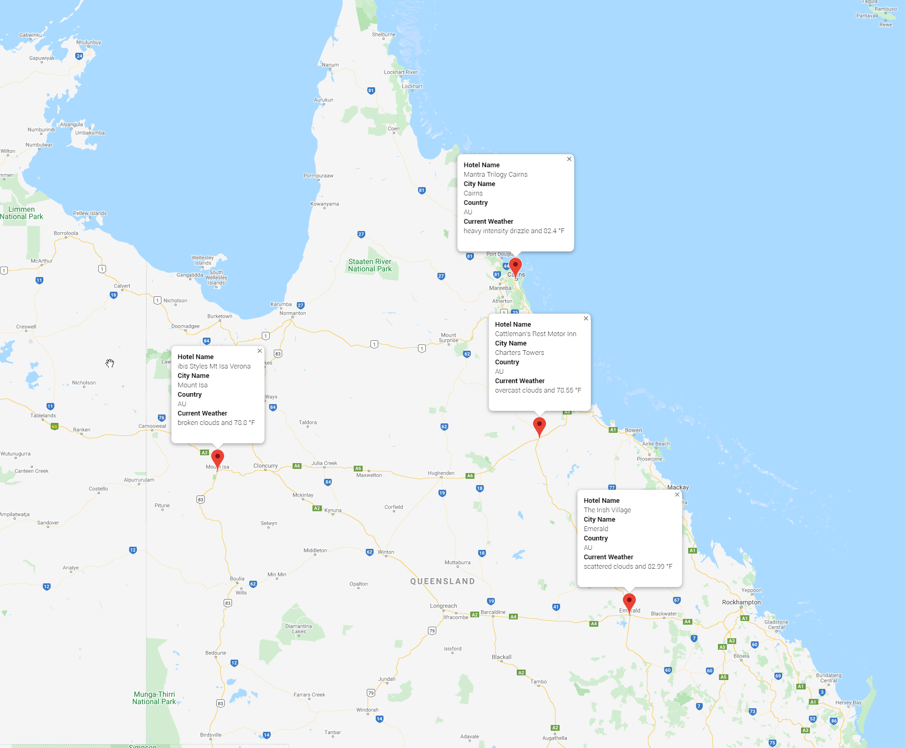
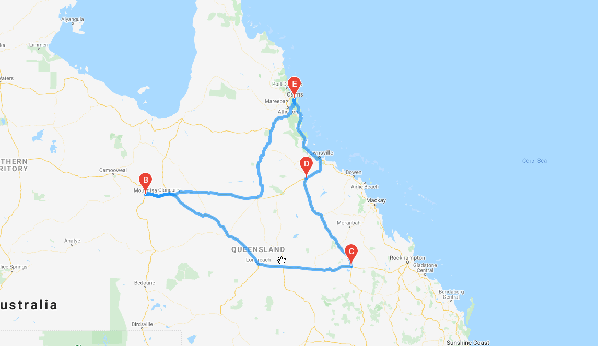

# World Weather Analysis

## Overview 

 Plan my trip is a top travel tech company that specializes in the internet related services in the hotel and lodging industry. It wishes to collect weather data and use the data to recommend ideal hotels based on clients' weather preferences.

### Purpose

The purpose of this project is to:

- Generate random latitudes and longitudes pairs.
- Find nearest cities.
- Retrieve the cities' weather data using OpenWeatherApp API.
- Take input from user for preferred temperatures and filter the results for potential travel destinations and nearby hotels and map them using gmaps.
- Use Google Maps Directions API to create a sample travel itinerary.

### Analysis

Data Source: All the data used in this project was retrieved using APIs. The following APIs were used: OpenWeatherApp, Google Places, Google Maps, Google Directions.

Software used: Python 3.7.6, Pandas, MatPlotLib, Jupyter Notebooks, Numpy, GMaps

Analysis Code: 
- Weather Data Retrieval [Weather Data Retrieval Code](Weather_Database/WeatherPy_Database.ipynb)
- Customer Travel Destinations Map [Travel Destinations Code](Vacation_Search/Vacation_Search.ipynb)
- Travel Itinerary [Travel Itinerary Code](Vacation_Itinerary/Vacation_Itinerary.ipynb)

### Results

The weather data was retrieved and saved in the following CSV file: **[Weather Data](Weather_Database/WeatherPy_Database.csv)**

The travel destinations and hotel information was retrieved and saved in the following CSV file: **[Vacation Data](Vacation_Search/WeatherPy_vacation.csv)**

#### Filtered travel destinations and nearby hotels shown on gmaps. 

(The markers display hotel name, city, country, current weather and maximum temperature.  )

#### Sample Itinerary on gmaps.
   

